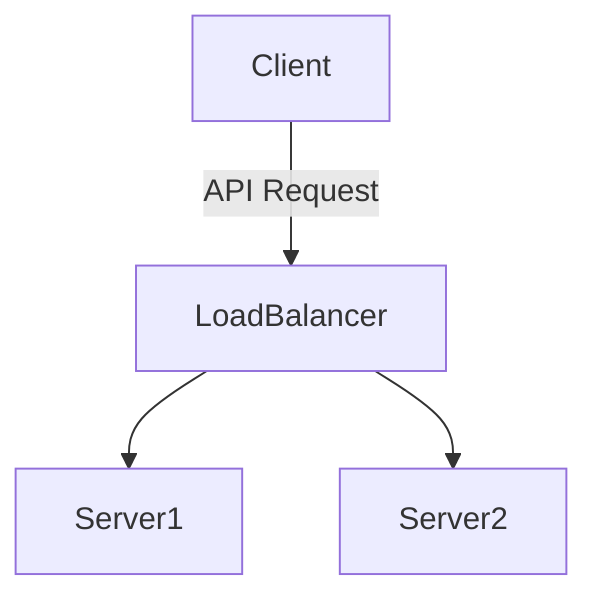

# Michael G. Hyle
Chicago, IL | 443-955-2331 | mikehyle@gmail.com | linkedin.com

---
## Professional Statement
Data Engineer, MBA graduate, successful at designing and implementing large-scale complex projects. Looking for hybrid opportunities in data engineering and data analytics in the Chicago area.

---

## Skills and Technologies

```html
<table>
  <tr>
    <td>Row 1, Cell 1</td>
    <td>Row 1, Cell 2</td>
  </tr>
  <tr>
    <td>Row 2, Cell 1</td>
    <td>Row 2, Cell 2</td>
  </tr>
</table>
```

| ETL/ELT | Google Cloud Platform | Amazon Web Services |
| Python | SQL | Bash                |

- Python
- SQL
- Bash

- Docker
- Kubernetes
- Pyspark

- Kafka
- Trino/Starburst
- Airflow

- Communication
- Presentation
- Project Management


Education
Johns Hopkins Carey Business School
Masters of Business Administration: Finance and Enterprise Risk Management

The Pennsylvania State University
Bachelor of Science: Chemical Engineering Major, Environmental Engineering Minor

Baltimore, MD
May 2018

University Park, PA
May 2011


Professional Experience
American Express
Data Engineer for Data Services Team

Chicago, IL (Remote)
April 2022 - March 2026
Current tasks include designing, coding proof of concepts, and deploying projects using internal frameworks. 
Technologies used: Python, SQL, GCS, Airflow, Github, Github Actions, Hackolade, SingleStore, S3, KAFKA, Couchbase, Parquet, Pyarrow, Docker, Kubernetes, Trino, Starburst
Project Descriptions:
Metadata Guardrail: Leading a team and also developing the back end for a web application form submission that will run scripts and a third party tool to auto generate table creation submissions to BigQuery. This submission form applies business rules to naming, descriptions, and other pieces of metadata to ensure proper table creation to business standards. Metadata is submitted to a third party tool (Hackolade) to auto generate the physical model of the table within the schema. This generated model is then used to auto generate the table DDL. Schema evolution is preserved via GitHub. Github Actions act as the CICD mechanism to move our DDLs to GCS. Once in GCS the DDLs trigger a cloud function to start an Airflow job to create the table in BigQuery.
Emergency data migration: Gathered migration requirements. Developed a bash script to automate data migration from SingleStore to cloud storage.
Enterprise Data Lake House: Working with a third party provider to stand up a data lake house solution that would be available to the entire enterprise. Allows for querying multiple database types and data in storage without the need for ETL.
Information Lifecycle Management (ILM): Coded with python and deployed on an internal framework, the code is executable via GUID and Rest API. Coded for Postgres and SingleStore, the solution archives tables, converts them to parquet file format, then stores them in cloud storage. From cloud storage, the table can be restored via a restore flow or users can query the data directly using Pyspark or other query engines including the Enterprise Data Lake House.
Kafka - Couchbase: Stream Couchbase mutations via a Kafka connector to S3 storage. Solution involved: Java code to filter Couchbase streams, python code to run and handle CB-Kafka connector, python code to run consumer that reads and converts CB streams to parquet file and stores file into Cloud Storage (AWS or GCP) with lifecycle policy applied.
Icehouse POC: Technologies used: Cloud Storage, Parquet, Iceberg, and Trino. Leverage the scalability of cloud storage to store data files in parquet format with an overlay of Iceberg Table format to read and manage from a Trino interface. Leverage Trino connection to incorporate BI tools of choice.
Mepco
Sr. Data Analyst/Engineer
Chicago, IL
July 2020 - April 2022
Mepco is a financial services company that offers flexible payment plans for auto warranties. Tasks include operations and maintenance, business analysis, and new system design.
Technologies used: Python, Excel, SQL, AWS, JIRA, Confluence
Project Descriptions:
Operations and Maintenance: Maintained an existing reporting system for sending data to partners. Work involved writing new SQL queries for reports, linking disparate databases via python, performing ad hoc scripting and Excel solutions to automate time consuming manual processes.
Business Analysis: Ran meetings with stakeholders, and created needed documentation to understand the current tech stack, pinpointed deficiencies, proposed improvements, and created JIRA stories.
New System Design: Designed the new reporting system. Involved a discovery phase of a schema audit and a report audit. Through this discovery phase, it was apparent that large improvements could be gained by running combined queries then using separate compute to split larger reports into specific client sub reports. ETL is performed by spark jobs running on AWS GLUE/EMR, which writes to a SnowFlake data warehouse.
Maven Wave, Partners LLC
Consultant, Data and Applications
Chicago, IL
Sep 2018 - July 2020
Data Engineer who delivered production-ready applications, scripts, and data solutions for clients.
Project Descriptions:
Title Release Modernization: I gathered the business and technical requirements to move this mainframe process to an AWS cloud process. I designed the data model for the NoSQL database table and wrote the logic for the title release process while working with open source and in house tooling. Technologies used: Python, AWS EMR, AWS Lambda, Pyspark, Hive, Cassandra
Migration - Microsoft to GSuite: Wrote various scripts and tools to automate tasks for a company wide migration to GSuite. Scripts included: Google Drive metadata update script deployed via Cloud Functions, source to target validation tool that would verify the migration of millions of files from Sharepoint to GSuite, and finally an emergency deletion script that deleted 12,000+ Migrated Google Drives and millions of files were deemed to contain sensitive information. Technologies used: Python, GCP, Cloud Functions, Big Query, MySQL
Data Warehousing: I wrote python code that would deploy Dataflow jobs from Cloud Composer to gather the information from disparate data systems, transform the data and write the data to staging tables in Big Query. Technologies used: Python, GCP, Cloud Composer (Airflow), Dataflow, Big Query, Cloud Functions, Cloud Scheduler


Certifications 
https://www.credly.com/users/michael-hyle/badges#credly



